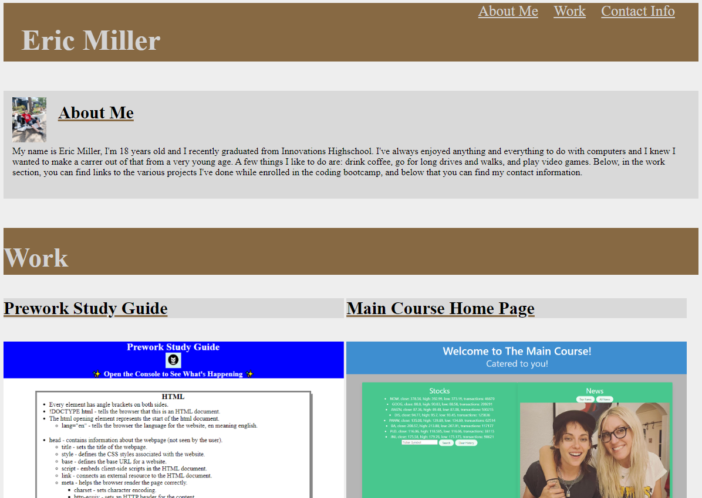

# 02 Advanced CSS: Portfolio

## Description

This project is a portfolio for me, Eric Miller, in which nav links can be found to the various sections (About Me, Work, and Contact Info). The about me section contains a picture
of me and a brief description of myself, in the work section there are 5 projects displayed that when clicked take the user to the deployed application, the last section contains my contact information including my phone number, email, and GitHub account. Additionally this webpage is made with a responsive design that adjusts the display based on the user's screen size.

[Deployed Portfolio](https://emill0004.github.io/02-Advanced-CSS-Portfolio/)

